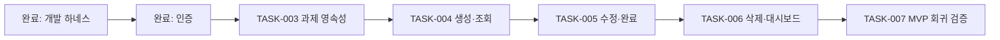

# RECORDS 백엔드 구현 로드맵

상태: **기본 검증 MVP 완료, 사진 자동 추출 PoC 진행 중**

이 문서는 현재 코드에서 이어서 구현할 백엔드 작업의 순서와 완료 조건을 고정한다. 기능별 상세 API·DB 계약은 [`assignments.md`](assignments.md)를 따른다.

## 현재 기준점

| 단계 | 상태 | 검증 근거 |
|---|---|---|
| Python `.venv`, PostgreSQL, Alembic, Make 하네스 | 완료 | `5d7e4b0`, `538598a`, `5ff358c`, `995c053` |
| 개발 규칙과 인증 계약 | 완료 | `1552382` |
| 가입, 로그인, 현재 사용자 조회 | 완료 | `9288b81` |
| 사용자별 과제 CRUD와 D-Day | 완료 | `8cb548e`, `e076a8d`, `a07a5d1`, `71e1baf` |
| 사진 과제 자동 추출 하네스 | 완료, 실모델 PoC 대기 | `docs/photo-extraction.md`, Mock 기반 회귀 테스트 |

## 이번 구현 범위

검증 MVP의 백엔드 흐름은 다음과 같다.

```text
회원가입 또는 로그인
→ Access Token 발급
→ 과제 생성
→ 날짜 범위별 과제 조회
→ 과제 수정 또는 완료 처리
→ 대시보드에서 가장 가까운 과제와 진행 중 개수 조회
→ 과제 삭제
```

다음 범위는 사진에서 과제 후보를 자동 추출하고 사용자가 확인하도록 제공하는 PoC다. 이메일 인증, Refresh Token, 비밀번호 재설정, 푸시 알림, 관리자 기능은 포함하지 않는다.

## 작업 의존성



TASK-004 이후 작업은 앞 작업의 migration과 API 계약을 전제로 한다. 앞 작업이 완료 조건을 통과하지 못하면 다음 작업을 시작하지 않는다.

## TASK-003 과제 영속성 추가 — 완료

- 목적: 인증 사용자에게 소유되는 과제를 PostgreSQL에 저장한다.
- 관련 요구사항: 사용자별 과제, 과제명, 과목, 마감 일시, 완료 여부, 생성·수정 일시.
- 구현 내용: `Assignment` model과 Alembic migration을 추가한다. `user_id` 외래 키, `subject` 제약, 시간대가 있는 timestamp, 사용자·마감일 복합 index를 포함한다.
- 선행 작업: 인증 구현 완료, [`assignments.md`](assignments.md)의 데이터 계약 확정.
- 담당 영역: DB, SQLAlchemy model, migration, model 검증 테스트.
- 우선순위: P0.
- 예상 난이도: 낮음.
- 기술적 위험: model과 migration의 column 또는 제약 불일치.
- 개인정보 위험: 요청의 `user_id`를 저장해 타 사용자 소유권으로 생성하는 오류.
- 테스트 방법: migration upgrade/downgrade 검토, 사용자 삭제 시 외래 키 동작, 필수 column과 subject 제약 검증.
- 완료 조건: 빈 DB에 `make migrate`가 성공하고 `assignments` table과 index가 문서 계약대로 생성된다.
- 권장 커밋 단위: `feat: add assignment persistence`.
- 실패 시 축소 방안: 별도 subject table을 만들지 않고 문서에 정의된 subject code를 `VARCHAR`와 `CHECK`로 유지한다.

## TASK-004 과제 생성·조회 구현 — 완료

- 목적: 로그인한 학생이 과제를 등록하고 자신의 과제만 조회한다.
- 관련 요구사항: 과제 생성, 날짜별·월간 조회, 상세 조회, D-Day 표시.
- 구현 내용: `POST /assignments`, `GET /assignments`, `GET /assignments/{assignment_id}`와 공통 응답 schema를 추가한다. D-Day는 저장하지 않고 Asia/Seoul 날짜를 기준으로 응답 시 계산한다.
- 선행 작업: TASK-003.
- 담당 영역: FastAPI router, Pydantic schema, SQLAlchemy query, endpoint test.
- 우선순위: P0.
- 예상 난이도: 보통.
- 기술적 위험: UTC timestamp와 한국 날짜 경계의 혼용, 범위 양 끝의 누락.
- 개인정보 위험: 식별자만으로 다른 사용자의 과제를 조회할 수 있는 객체 권한 취약점.
- 테스트 방법: 정상 생성, 입력 검증, 월 경계 조회, D-Day 전날·당일·지난 날, 사용자 A의 식별자로 사용자 B가 조회하는 시나리오.
- 완료 조건: 생성 요청에 `user_id`가 없어도 토큰 사용자가 소유자로 저장되고, 타 사용자 조회는 존재 여부를 숨기는 `404 ASSIGNMENT_NOT_FOUND`를 반환한다.
- 권장 커밋 단위: `feat: implement assignment creation and queries`.
- 실패 시 축소 방안: pagination은 추가하지 않고 조회 범위를 최대 62일로 제한한다.

## TASK-005 과제 수정·완료 처리 구현 — 완료

- 목적: 학생이 자신의 과제 정보와 완료 상태를 안전하게 변경한다.
- 관련 요구사항: 과제 수정, 완료, 완료 취소, 완료를 삭제로 처리하지 않음.
- 구현 내용: `PATCH /assignments/{assignment_id}`와 `PUT /assignments/{assignment_id}/completion`을 추가한다. 완료 시각으로 상태를 표현하고 반복 요청은 동일 결과를 반환한다.
- 선행 작업: TASK-004.
- 담당 영역: FastAPI router, update query, schema, endpoint test.
- 우선순위: P0.
- 예상 난이도: 보통.
- 기술적 위험: 빈 PATCH 허용, 완료를 반복할 때 시각이 계속 바뀌는 비멱등 동작.
- 개인정보 위험: update query에서 소유자 조건이 빠지는 객체 권한 취약점.
- 테스트 방법: 일부 필드 수정, 빈 body와 `null` 거절, 완료·완료 취소 반복, 타 사용자 수정 시도.
- 완료 조건: 과제 식별자와 현재 사용자 ID를 같은 DB 조건에 사용하며 완료 반복 요청이 기존 `completedAt`을 보존한다.
- 권장 커밋 단위: `feat: implement assignment updates and completion`.
- 실패 시 축소 방안: 범용 상태 enum 없이 `completed_at IS NULL`만으로 미완료를 판단한다.

## TASK-006 과제 삭제·대시보드 구현 — 완료

- 목적: 과제 생명주기를 마무리하고 메인 화면에 필요한 집계값을 한 번에 제공한다.
- 관련 요구사항: 과제 삭제, 진행 중 개수, 가장 가까운 미완료 과제, D-Day.
- 구현 내용: `DELETE /assignments/{assignment_id}`와 `GET /dashboard`를 추가한다. 현재 첨부 파일이 없으므로 과제는 hard delete한다.
- 선행 작업: TASK-005.
- 담당 영역: FastAPI router, aggregate query, endpoint test.
- 우선순위: P0.
- 예상 난이도: 보통.
- 기술적 위험: 지난 과제와 예정 과제가 함께 있을 때 대표 과제 선정 규칙 불일치.
- 개인정보 위험: 다른 사용자의 개수 또는 대표 과제가 집계에 섞이는 데이터 노출.
- 테스트 방법: 과제 없음, 예정 과제만 있음, 지난 과제 포함, 완료 과제 제외, 타 사용자 데이터 격리, 삭제 후 재조회.
- 완료 조건: 대시보드 집계가 현재 사용자 데이터만 사용하고 삭제 후 상세 조회가 `404`를 반환한다.
- 권장 커밋 단위: `feat: add assignment dashboard and deletion`.
- 실패 시 축소 방안: 별도 집계 table이나 cache 없이 현재 `assignments` table을 직접 조회한다.

## TASK-007 검증 MVP 백엔드 회귀 검증 — 완료

- 목적: 인증부터 과제 생명주기까지 하나의 사용 흐름으로 검증한다.
- 관련 요구사항: 검증 가능한 MVP, 권한 통제, migration과 품질 게이트.
- 구현 내용: 중복되는 구현을 추가하지 않고 통합 시나리오, OpenAPI, migration, lint, 로그 노출 여부를 점검한다. 발견된 결함만 최소 수정한다.
- 선행 작업: TASK-006.
- 담당 영역: 통합 테스트, 보안 회귀, 문서 동기화.
- 우선순위: P0.
- 예상 난이도: 낮음.
- 기술적 위험: 개별 endpoint 테스트는 통과하지만 전체 흐름 또는 새 DB에서 실패하는 문제.
- 개인정보 위험: 응답이나 로그에 비밀번호 hash, JWT, 다른 사용자의 식별 정보가 포함되는 문제.
- 테스트 방법: 새 DB migration 후 가입 → 로그인 → 생성 → 목록 → 수정 → 완료 → 삭제 순서 실행, 사용자 두 명의 교차 접근 시도, `make check`, `git diff --check`.
- 완료 조건: 전체 흐름과 교차 접근 테스트가 성공하고 문서·OpenAPI·실제 응답이 일치한다.
- 권장 커밋 단위: 결함이 없다면 별도 커밋하지 않는다. 테스트 보강이 필요하면 `test: cover assignment lifecycle`로 커밋한다.
- 실패 시 축소 방안: 기능 범위를 줄이지 않고 실패한 동작의 원인만 수정한다. 보안 검증은 축소하지 않는다.

## 커밋 계획

각 TASK는 위에 적힌 단일 Conventional Commit을 기본으로 한다. 커밋 전에는 다음을 지킨다.

```bash
make check
git diff --check
git add <해당 TASK 파일만>
git diff --cached --check
git commit -m "<TASK의 권장 커밋 메시지>"
```

테스트와 구현은 같은 기능 커밋에 포함하고, 다음 TASK의 일부를 미리 섞지 않는다. 사용자 요청 없이 push하지 않는다.

## 현재 범위 뒤의 착수 조건

아래 항목은 해야 할 수 있지만 지금 구현할 작업은 아니다. 조건을 만족하면 각각 새 계약 문서를 만든 뒤 TASK 번호를 부여한다.

| 후순위 기능 | 착수 조건 | 계약에서 먼저 결정할 내용 |
|---|---|---|
| 사진 첨부 | 과제 등록 흐름 검증 후 사진이 실제 핵심 사용으로 확인됨 | 비공개 저장소, MIME 검사, 크기 제한, EXIF 제거, 삭제 순서 |
| 이메일 인증·비밀번호 재설정·Refresh Token | 제한된 검증 그룹이 아닌 공개 가입을 허용함 | 메일 발송자, 토큰 만료·일회성, 세션 폐기, 재가입 정책 |
| D-7·D-4·D-1 푸시 | 클라이언트 형태와 실제 기기 알림 PoC가 확정됨 | 기기 token, 시간대, 수정·완료·삭제 시 취소, 재시도와 중복 방지 |
| 배포·모니터링·백업 | 외부 학생에게 접속 URL을 제공하기 전 | 운영 DB, secret, TLS, 로그 비식별화, 백업·복구와 삭제 정책 |

관리자, 사용자 정의 과목, 반복 일정, 공유 기능은 별도 제품 요구가 생기기 전까지 문서와 구현 모두 확장하지 않는다.

## 다음 착수점

사진 자동 추출 하네스는 구현됐다. 다음 작업은 비식별 테스트 이미지 한 장으로 유료 호출 1회를 수행하고, 실제 응답과 사용 토큰을 확인하는 것이다. 상세 범위와 검증 기준은 [`photo-extraction.md`](photo-extraction.md)를 따른다.
